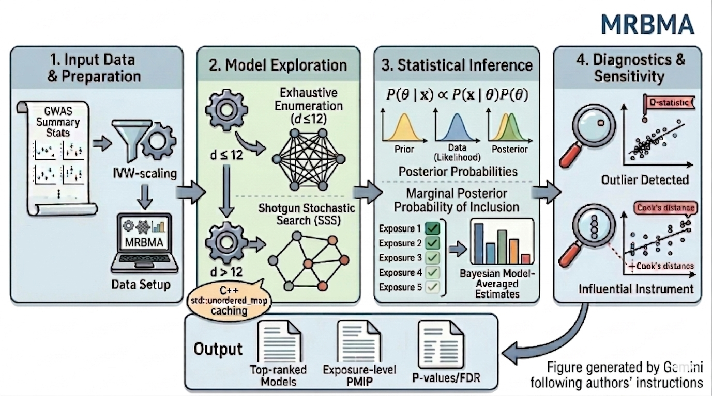

# MRBMA: Bayesian model averaging for multivariable Mendelian randomization

This R package (version: **0.1.0**) implements the **MRBMA** method ([Zuber et al., 2020](https://doi.org/10.1038/s41467-019-13870-3)), a Bayesian multivariable Mendelian randomization (MR) approach that uses Bayesian model averaging (BMA) to identify and prioritise causal exposures from summary statistics. **MRBMA** addresses the fundamental challenge of model uncertainty in multivariable MR: rather than selecting a single model, it averages over all plausible subsets of exposures, weighting each by its posterior probability.

The development of **MRBMA** was motivated by the need to prioritise causal NMR metabolites for age-related macular degeneration (AMD) from a large panel of correlated exposures, where standard multivariable MR methods suffer from model selection instability.

**MRBMA** combines three key ingredients:
<ul>
    <li> A closed-form log Bayes factor derived from summary-level data, making the method applicable to GWAS data without individual-level access;</li>
    <li> Two complementary search strategies: exhaustive enumeration of all 2<sup>d</sup>&minus;1 models for small exposure sets (d &le; 12) and a shotgun stochastic search (SSS, <a href="https://doi.org/10.1198/016214507000000121">Hans et al., 2007</a>) for a larger number of exposures;</li>
    <li> A permutation procedure (<a href="https://doi.org/10.1161/CIRCULATIONAHA.121.053797">Levin et al., 2021</a>) to compute empirical p-values and Benjamini-Hochberg false discovery rate (FDR) corrections.</li>
</ul>

All inner-loop matrix computations are implemented in C++ via **RcppArmadillo**, with the SSS hash table using `std::unordered_map`. This yields 10&ndash;50x speedups over a pure R implementation.

**MRBMA** returns for each exposure: the Marginal Posterior Probability of Inclusion (MPPI), the Bayesian model-averaged causal estimate, and an empirical p-value obtained under the permutation scheme. It also returns the top-ranked models by posterior probability, each with its constituent exposures and causal estimates.

Diagnostic functions detect influential instrumental variables (IVs) (Cook's distance, [Cook, 1977](https://doi.org/10.1080/00401706.1977.10489493)) and outlying instruments (Q-statistic), enabling sensitivity analyses with flagged IVs removed.

One data set is included in the R package:
<ul>
    <li> <b>AMD_data</b>: summary-level genetic association data for 30 circulating NMR metabolites and age-related macular degeneration (AMD). The 148 independent genetic variants (SNPs) used as instrumental variables were selected at genome-wide significance from the NMR metabolite GWAS of <a href="https://doi.org/10.1038/ncomms11122">Kettunen et al. (2016)</a>, and AMD associations were obtained from <a href="https://doi.org/10.1038/ng.3448">Fritsche et al. (2015)</a>.</li>
</ul>

## Installation

The installation of **MRBMA** requires the following steps:

1.  Install the **devtools** package. This can be done from **CRAN**. Invoke R and then type

    ```
    install.packages("devtools")
    ```
    
2.  Load the **devtools** package

    ```
    library("devtools")
    ```

3.  Install the **MRBMA** package by typing

    ```
    devtools::install_github("lb664/MRBMA")
    ```

4.  Finally, load the **MRBMA** package

    ```
    library("MRBMA")
    ```

## Example 1

The first example runs a single-exposure model (kmin = kmax = 1), equivalent to a univariable BMA scan across all 30 NMR metabolites. After loading and IVW-scaling the data:

    data(AMD_data)
    betaX_ivw   <- as.matrix(AMD_data$betaX) / AMD_data$seAMD
    betaAMD_ivw <- AMD_data$betaAMD / AMD_data$seAMD
    rs          <- AMD_data$annotate[, 1]
    rf          <- colnames(AMD_data$betaX)

an `mvMRInput` object is constructed:

    AMD_input <- new("mvMRInput",
                     betaX    = betaX_ivw,
                     betaY    = as.matrix(betaAMD_ivw),
                     snps     = rs,
                     exposure = rf,
                     outcome  = "AMD")

and the single-exposure BMA is run:

    MRBMA_out_k1 <- MRBMA_SSS(AMD_input, kmin = 1, kmax = 1,
                              sigma = 0.5, prior_prob = 0.1)

Results are reported as the top 10 models and the exposure-level summary table:

    report_best_models(MRBMA_out_k1, top = 10)
    report_MRBMA(MRBMA_out_k1, top = 10)

## Example 2

The second example runs MRBMA with SSS to explore multi-exposure models of size 1 to 12:

    MRBMA_out <- MRBMA_SSS(AMD_input, kmin = 1, kmax = 12,
                           max_iter = 100, sigma = 0.5, prior_prob = 0.1)

    report_best_models(MRBMA_out, top = 10)
    report_MRBMA(MRBMA_out, top = 10)

Diagnostic functions identify influential and outlying IVs:

    MRBMA_diag <- MRBMA_diagnostics(MRBMA_out, diag_ppthresh = 0.02)

If flagged SNPs are found, a sensitivity analysis re-runs MRBMA on the reduced instrument set.

**Warning!** In Example 2, max_iter is set to 100 for illustration only. For stable results, we recommend max_iter &ge; 10,000. For publication-quality results use max_iter = 100,000.

## Example 3

Empirical p-values are obtained via permutation of the outcome association vector. A test run (nrepeat = 100) assesses runtime before committing to the full run:

    MRBMA_perm_mat <- MRBMA_permutations(MRBMA_out, nrepeat = 100,
                                         save_matrix = FALSE, verbose = TRUE)
    MRBMA_pvalues(MRBMA_out, MRBMA_perm_mat)

For final results, use nrepeat = 100,000. Runtime scales linearly with nrepeat and is approximately nrepeat &times; t<sub>single</sub>, where t<sub>single</sub> is the runtime of a single MRBMA run.

**Warning!** P-values based on nrepeat = 100 are not reliable. Use nrepeat &ge; 100,000 for publication results as in [Levin et al. (2021)](https://doi.org/10.1161/CIRCULATIONAHA.121.053797).

## Issues

To report an issue, please use the **MRBMA** issue tracker at [BugReports](https://github.com/lb664/MRBMA/issues)

This software uses the GPL v2 license, see [License](https://github.com/lb664/MRBMA/blob/main/LICENSE). Authors and copyright are provided in [Description](https://github.com/lb664/MRBMA/blob/main/DESCRIPTION)
